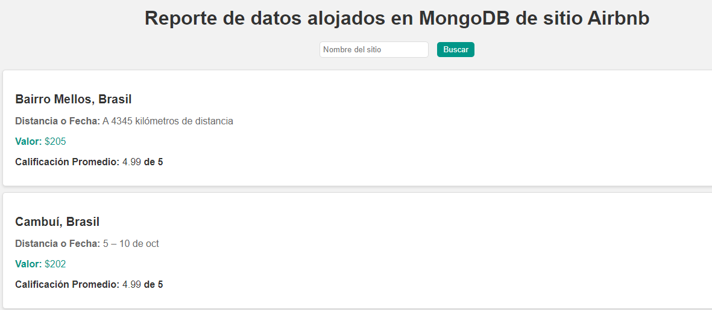

# Proyecto de Informe de Airbnb

Este proyecto es una aplicación web que muestra información obtenida del sitio Airbnb, en donde permite buscar los alojamientos por nombre y mostrar detalles como distancia, valor y calificación.


## Requisitos

- Python 3.x
- Las dependencias listadas en el archivo `requirements.txt`

## Instalación

1. Clona el repositorio en tu máquina local.
2. Instala las dependencias ejecutando el siguiente comando en la terminal:    

Instalar librerias
```commandline
pip install -r requirements
```
## Configuración
###  Variables
Antes de ejecutar el programa, es necesario  configurar las siguientes variables de entorno en un archivo `.env`:

```commandline

MONGO_USER=username # replace with yours
MONGO_PASSWORD=password # replace with yours
MONGO_HOST=cluster0.patata.mongodb.net # replace with yours
```
Asegúrate de reemplazar los valores de las variables con tu información personal.

## Uso

1. Ejecuta el archivo `main.py` para iniciar el proceso de generar el sitio con Flask.

## Uso

1. Abre un navegador web y accede a `http://localhost:5000`.
2. Ingresa el nombre de un sitio en el campo de búsqueda y haz clic en "Buscar".
3. Los resultados de Airbnb se mostrarán en la lista a continuación, con detalles como título, distancia, valor y calificación.


Reporte generado



Si tienes alguna pregunta o problema, no dudes en abrir un problema (issue) en este repositorio.

## Autor

- [@econdor9](https://github.com/econdor9)

[](https://opensource.org/licenses/)

   